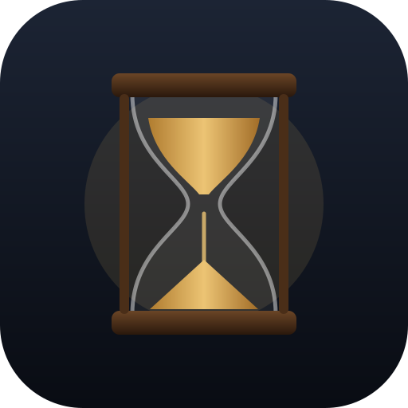

# Hourglass

A quiet, full-screen hourglass timer. Pick how long the sand should run, press
Start, and watch it fall. Nothing counts down but the sand: there is no clock,
no progress bar, no number anywhere while it runs.

## Using it

- **Length:** type `5` (minutes), `90s`, `1:30`, `2m30s`, `1h30m`, or tap a
  preset. Anything from 3 seconds to 24 hours.
- **URL:** `?d=10m` presets the length; add `&go` to start immediately
  (`hourglass/?d=25m&go`). The last length you used is remembered.
- **While it runs:** the controls disappear. Move the mouse or tap to reveal a
  single `×` that stops and resets (also `Esc`).
- **When it finishes:** a soft chime (optional), then "Time's up". Tap the
  hourglass (or press Space) to turn it over and run it again.
- On phones the screen stays awake while the sand runs (Wake Lock, where
  supported).

## How it's drawn

One `<canvas>`, no dependencies. The glass is a symmetric profile curve; the
sand is not simulated grain by grain. Instead, at every frame the elapsed
fraction of the chosen length sets how much sand has moved, and the two sand
surfaces are solved analytically by bisection:

- the **top** bulb holds sand beneath a crater at the angle of repose whose
  rim touches the glass at the solved height;
- the **bottom** bulb holds a mound at the same angle whose apex height is
  solved for the same area.

So the timing is exact regardless of frame rate or tab throttling, and the
final mound is the mirror image of the starting crater, which is what makes
the flip-to-restart look seamless. The falling stream and the little grains
that skitter down the mound are cosmetic particles on top.

`?f=0.4` freezes the sand at a fraction, mid-flow, for screenshots.
