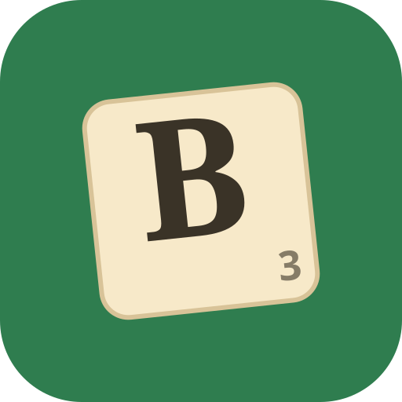

# Scrabble Bingo Trainer

A phone-first, offline, drag-the-tiles trainer for finding **bingos** (playing all
7 tiles at once, for the +50 bonus). No app store, no typing, no account — an
installable web app (PWA) that runs entirely on your device, including on the
subway.



## What it does

Two modes:

- **Rack (7):** you get a rack of 7 tiles that is *guaranteed* to make at least one
  7-letter word. Drag them into order until it spells a bingo. This is the core
  anagram-recognition skill.
- **Board (8, through-tile):** a locked "board" tile sits in the middle; drag your
  7 rack tiles around it to make an 8-letter word playing *through* that letter.
  This is the "find the 8 through the T" skill you need in a real game.

Under the hood, three ideas do the teaching:

1. **Realistic racks.** Racks are generated *backwards* from a real word, so a
   solution always exists. Words are ranked by their true probability of being
   drawn from a Scrabble bag (combinatorics over the actual 100-tile
   distribution), so the **Difficulty** slider moves you from the bingos you'll
   genuinely draw a lot (AILERON, ELATION, LATRINE, RETINAS…) out toward the
   obscure ones. Train the common stuff first — that's where the points are.
2. **Spaced repetition.** Every rack you miss becomes a Leitner item and comes
   back on a widening schedule (2 → 6 → 15 → 40 → 100 turns) until it sticks.
   Get it right and it graduates; miss it and it resets. All in `localStorage`.
3. **See the whole family.** Solving (or giving up) shows *every* valid word for
   those tiles — e.g. AEGINST → SEATING · TEASING · INGESTA · TAGINES · EASTING · INGATES.
   Seeing the anagram family is how the patterns get burned in.

Auto-detects the win the instant the tiles spell a valid word. Hint reveals the
number of solutions, then letters one at a time. Streak / solved / due counters
up top; a Leitner-box histogram lives in Settings.

## Run it

It's a static site — no build step, no dependencies.

- **Locally:** `python3 -m http.server` in this directory, open the URL. (A
  service worker is used, so open it over `http://localhost`, not a `file://`
  path.)
- **On your phone (the point):** host it anywhere static and open it once with a
  signal, then **Add to Home Screen**. After that first load it works fully
  offline. A ready-made GitHub Pages workflow
  (`.github/workflows/bingo-trainer-pages.yml`) is included — enable Pages
  (repo *Settings → Pages → Source: GitHub Actions*) and it mounts this folder
  under a `/bingo/` subpath, so the URL is
  `https://<user>.github.io/<repo>/bingo/` (with a small landing page from
  `www/` at the repo-Pages root). Every toy gets its own subpath; add another by
  dropping a `cp` line in that workflow.

## Files

```
index.html            markup + PWA wiring
styles.css            Scrabble-tile styling, light/dark, phone-first
app.js                word index, probability ranking, SRS, the drag engine
data/words7.js        23,109 seven-letter words   (generated)
data/words8.js        28,420 eight-letter words   (generated)
sw.js                 service worker (offline cache)
manifest.webmanifest  installability
icon.svg / *.png      app icons
build/generate.py     regenerate data/ from the ENABLE word list
build/make_icons.py   regenerate the PNG icons (needs Pillow)
build/test_logic.js   word-logic sanity checks   (node)
build/test_browser.js end-to-end UI + drag + win tests (needs playwright)
build/test_offline.js verifies it works with the network cut
```

## Regenerating the word data

```
python3 build/generate.py      # fetches the public-domain ENABLE list if missing
```

The word list is **[ENABLE](https://en.wikipedia.org/wiki/Enhanced_North_American_Benchmark_Lexicon)**
(Enhanced North American Benchmark Lexicon), which is public domain. It's close
to the North American tournament list but is *not* the official TWL/CSW — a
handful of words will differ from what's valid in a rated club game. Swap in any
newline-delimited word list and re-run `generate.py` to change dictionaries.

## Notes / possible next steps

- **Blanks** aren't modeled yet (every rack is 7 real letters). Real racks draw
  blanks ~14% of the time and they're a big part of bingo-finding; a blank tile
  you assign a letter to would be the natural next feature.
- Board mode fakes the board with a single through-tile rather than a fully legal
  position — enough to train the skill without a board engine.
- The probability weight ignores blanks in the bag (classic anagram-app
  convention), which is why very-high-difficulty racks trend toward
  double-letter and rare-tile words.
